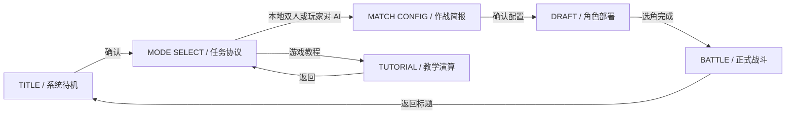

# 主页与游戏模式界面张力重设计

## 1. 文档目的

本文为 `MECHA CTB TACTICS` 的主页、游戏模式选择及其后续对局配置流程提供一套可直接落地的视觉与交互设计。

目标不是单纯增加粒子、闪烁或放大标题，而是让玩家从启动游戏到进入选角的过程中，持续感受到：

- 即将进入战术行动的仪式感；
- 角色与阵营即将交锋的压迫感；
- 每次选择都会改变下一场战斗的明确反馈；
- 与现有战斗界面、人物图鉴一致的机械战术风格。

本文只定义设计与实施边界，不在此阶段修改游戏代码。

---

## 2. 当前界面诊断

### 2.1 当前结构

当前启动流程在 `main.gd::_ready()` 中直接调用 `_show_mode_menu()`。主页和模式选择实际上是同一个页面：

- 全屏深色遮罩；
- 居中的 `640 × 440` 面板；
- 居中的游戏标题、副标题和三个等宽按钮；
- 规模、棋盘与出生方式继续复用同一种居中面板。

### 2.2 张力不足的主要原因

| 问题 | 当前表现 | 对体验的影响 |
|---|---|---|
| 缺少独立主页 | 启动后立即看到模式按钮 | 没有品牌登场和情绪建立 |
| 焦点被卡片限制 | 标题和操作都封闭在中央面板 | 画面显得小、平、像设置窗口 |
| 没有角色信号 | 首页不展示角色、武器或棋盘 | 玩家无法在首屏感知游戏题材 |
| 缺少空间纵深 | 背景是接近纯色的遮罩 | 没有战场距离、前后层次与对峙关系 |
| 选项反馈偏弱 | 三个按钮只有普通控件差异 | 模式的玩法区别没有被视觉化 |
| 页面节奏重复 | 模式、规模、棋盘、出生方式都换一张相似卡片 | 每次点击都像填写表单，进入战斗前的期待感被消耗 |
| 信息层级平均 | 红、蓝、金都作为常规装饰存在 | 缺少“当前焦点”和“确认行动”的颜色纪律 |

结论：需要先重建页面层级和空间关系，再添加动效。只给当前中央面板增加震动、粒子或发光，无法解决根本问题。

---

## 3. 推荐创意方向：战术演算启动

将开始流程理解为一次“战术系统从待机到部署”的过程：

1. **主页：系统唤醒**  
   展示游戏名、主要角色与战场空间，让玩家进入世界。
2. **模式选择：任务协议**  
   玩家选择本地对战、AI 对战或教程，右侧战场实时切换预演。
3. **对局配置：作战简报**  
   规模、棋盘与出生方式在同一个配置空间内逐步锁定。
4. **选角：部署人员**  
   沿用现有 Draft，完成从“任务”到“角色”的收束。
5. **进入战斗：执行行动**  
   配置界面沿棋盘透视方向推进，切入正式战场。

这条方向适合当前项目：已有六张透明角色立绘、红蓝阵营色、CTB 战棋盘和醒目的英文菜单字体，不需要重新建立一套美术语言。

---

## 4. 页面流程



关键决策：主页与模式选择必须成为两个明确状态。战斗结束的“返回模式选择”可以回到 `MODE SELECT`；暂停菜单中的“返回标题”应回到 `TITLE`。

---

## 5. 主页设计

### 5.1 视觉目标

主页应在第一秒内回答三个问题：

- 这是什么游戏：机械角色战术对战；
- 谁在战斗：角色立绘和武器必须是首屏主体；
- 玩家下一步做什么：进入模式选择。

主页不使用居中卡片。标题、角色和入口直接存在于全屏构图中。

### 5.2 1600 × 900 基准线框

```text
┌──────────────────────────────────────────────────────────────────────────────┐
│  SYSTEM 06 / CTB PROTOCOL                                      BUILD 0.x    │
│                                                                              │
│      MECHA                                                                  │
│      CTB TACTICS              夜链（前景）        曜锋（中景）               │
│      机械战术演算                                                        ╱   │
│                                                                          ╱   │
│      [ 进入战术系统 ]                         熔芯（后景）              ╱     │
│      图鉴 / 设置 / 退出                                                   │
│                                                                              │
│  ───── CTB READY ─────        透视棋盘、行动轨迹、阵营边界                 │
└──────────────────────────────────────────────────────────────────────────────┘
```

### 5.3 构图规则

#### 左侧：品牌和命令

- 游戏名占据左侧约 `520 px` 宽度，基准字号 `88–96 px`；
- `MECHA` 与 `CTB TACTICS` 分成两行，避免横向挤压；
- 中文副标题只承担类型说明，字号 `22–26 px`；
- 主命令放在标题下方，不使用大面积按钮卡片；
- 主要操作只保留一个高优先级入口“进入战术系统”；图鉴、设置、退出为低权重命令列。

#### 右侧：角色对峙

- 使用现有透明立绘，不新造风格不一致的插画；
- 夜链位于中右前景，承担主要轮廓；
- 曜锋从右侧切入，刀刃形成指向画面中心的斜线；
- 熔芯放在后方偏下，锤体稳定画面重心；
- 三人不需要完整露出，允许由画面边缘裁切，但脸、武器识别点和主体轮廓必须完整；
- 角色之间保持前、中、后三层缩放差，避免排成角色图鉴式横队。

#### 背景：战场而非装饰

- 使用低对比度透视棋盘作为地面；
- 棋盘只显示 5–7 条主要纵深线和少量格线，不与正文争抢；
- 增加两条阵营边界或行动轨迹，形成朝向中心的方向性；
- 不使用无意义的渐变光球、散景圆点或大面积烟雾遮挡角色；
- 可加入少量矩形扫描标记、单位坐标和 CTB 刻度，但密度应低于战斗 HUD。

### 5.4 主页色彩

沿用现有颜色常量，但重新分配职责：

| 颜色 | 色值 | 主页职责 |
|---|---|---|
| 深黑 | `#0B0C14` | 主背景与留白 |
| 面板黑 | `#14161F` | 局部信息底，不形成中央大卡片 |
| 战术红 | `#EE232F` | 主入口、警戒线、确认瞬间 |
| 阵营蓝 | `#3589E0` | 对峙侧、次级轨迹 |
| CTB 金 | `#FFD241` | READY、当前聚焦和关键数值 |
| 主文字 | `#F7F4EB` | 标题与主要标签 |
| 次文字 | `#858B9C` | 系统编号与辅助信息 |

同一时刻只允许一个主强调色。主页待机时以红色为主；焦点移动到次级菜单时，不同时点亮红、蓝、金三种颜色。

### 5.5 入场动效时间轴

| 时间 | 动作 | 目的 |
|---|---|---|
| `0–120 ms` | 深黑背景出现，绘制一条横向扫描线 | 建立启动节拍 |
| `120–380 ms` | 棋盘从下方沿透视方向展开 | 建立空间纵深 |
| `180–620 ms` | 后景、 中景、前景角色依次滑入 `16–42 px` | 形成层次，不做大幅飞入 |
| `340–700 ms` | 游戏名按行揭示，红色切线扫过标题 | 建立品牌瞬间 |
| `620–900 ms` | 主命令与低权重命令依次出现 | 把注意力交还给操作 |
| `900 ms` 后 | 进入低幅循环状态 | 保持呼吸感 |

任意确认输入应立即结束入场动画并进入可操作状态，不能强迫玩家每次等待完整演出。

### 5.6 待机循环

- 角色只做 `2–4 px` 的缓慢视差，不做整体呼吸缩放；
- 棋盘扫描线每 `3–4 s` 经过一次；
- CTB READY 标记每 `1.6 s` 做一次短促亮度脉冲；
- 刀刃、胸部核心等已有高亮部位可以轻微增强，但禁止全身同时泛光；
- 长时间无输入时可轮换前景角色，切换必须使用遮挡或扫描转场，不做简单淡入淡出叠影。

---

## 6. 模式选择设计

### 6.1 结构

模式选择采用“左侧命令列 + 右侧模式预演”，不使用三张并排营销卡片，也不使用居中的表单面板。

```text
┌──────────────────────────────────────────────────────────────────────────────┐
│  MODE SELECT / 任务协议                                      01 / 03        │
│                                                                              │
│  ┌────────────────────────┐       当前模式的全屏视觉预演                    │
│  │ 01  本地双人           │       ─ 两组角色隔线对峙                       │
│  │     LOCAL VERSUS       │       ─ 中央显示 VS 与选角顺序                 │
│  ├────────────────────────┤       ─ 背景保留棋盘透视                       │
│  │ 02  玩家对 AI          │                                                  │
│  │     PLAYER VS AI       │       模式标签 / 玩家数 / 选角方式             │
│  ├────────────────────────┤                                                  │
│  │ 03  游戏教程           │                                                  │
│  │     TUTORIAL           │                                                  │
│  └────────────────────────┘                         [ 确认模式 ]             │
│  返回标题                                                                    │
└──────────────────────────────────────────────────────────────────────────────┘
```

### 6.2 左侧模式列

- 固定宽度约 `460–500 px`；
- 三个选项使用固定高度 `76–84 px`，焦点变化不改变布局尺寸；
- 编号、中文名和英文标识形成三层信息；
- 选中态通过左侧色条、边框、文字亮度和右侧预演共同表达，不只依赖颜色；
- 未选项降低对比度但保持可读，不使用整项模糊；
- “返回标题”与模式列表拉开间距，避免误操作。

### 6.3 右侧实时预演

#### 本地双人

- 红、蓝两组角色分别从两侧进入；
- 中央显示窄而高的 `VS` 分界；
- 底部标签：`2 PLAYERS / SNAKE DRAFT / SHARED DEVICE`；
- 视觉重点是“对峙”。

#### 玩家对 AI

- 玩家侧角色保持清晰；
- AI 侧使用角色剪影、锁定框和 CTB 预测线；
- 底部标签：`1 PLAYER / RANDOM AI DRAFT / TACTICAL`；
- 视觉重点是“被系统锁定”。

#### 游戏教程

- 使用 `3 × 3` 小棋盘和两名示范角色；
- 显示移动路径、命中热区和一条步骤编号；
- 底部标签：`6 CHAPTERS / STEP PLAYBACK / PRACTICE`；
- 视觉重点是“可控的演算”。

### 6.4 模式切换动效

- 焦点移动：`120–160 ms`；
- 左侧选中条沿纵向滑动，不逐项重新生成；
- 右侧预演采用方向一致的遮挡切换，时长 `220–280 ms`；
- 快速连续移动焦点时取消上一个 Tween，避免动画排队；
- 确认模式时，右侧预演向棋盘消失点推进 `280–360 ms`，衔接对局配置页。

### 6.5 声音反馈

- 移动焦点：短促机械拨片声，音量低；
- 模式切换完成：不同模式使用同一音色的三个变体，而不是三套不相关音效；
- 确认：低频闭锁声 + 轻微高频确认声；
- 返回：使用更短、更干的解除锁定声；
- 不给循环扫描线添加持续声音，避免主页噪声疲劳。

---

## 7. 对局配置页：延续张力

当前规模、棋盘、出生方式分别调用 `_show_choice_menu()`，连续出现三张相似面板。建议合并为一个“作战简报”页面。

### 7.1 推荐布局

- 左侧：四步状态列 `模式 → 规模 → 棋盘 → 出生`；
- 中央：棋盘实时预览，规模和出生方式改变时立即更新；
- 右侧：当前配置摘要与“进入选角”；
- 顶部：当前模式名称与双方标识；
- 底部：返回上一步、重置配置。

### 7.2 控件映射

| 设置 | 推荐控件 | 反馈 |
|---|---|---|
| 对局规模 | `1 VS 1 / 2 VS 2 / 3 VS 3` 分段选择 | 棋盘上单位占位符同步增减 |
| 棋盘大小 | `5 × 5 / 6 × 6 / 7 × 7` 分段选择 | 预览格数和镜头距离同步变化 |
| 出生方式 | 固定 / 随机二态切换 | 固定显示两角，随机显示多个候选落点 |
| 确认 | “进入选角”命令 | 棋盘边界闭合，进入 Draft |

这样可以把玩家的连续选择变成“逐步完成部署”，而不是连续填写三个弹窗。

### 7.3 低成本过渡方案

如果第一阶段不合并流程，至少应让 `_show_choice_menu()`：

- 保留主页棋盘背景，不重新铺纯色遮罩；
- 使用左对齐标题和横向选项带；
- 在顶部显示 `01/03`、`02/03`、`03/03`；
- 下一页沿同一方向推进，返回沿反方向退出；
- 不再每页重新出现中央大边框。

---

## 8. 字体与图形语言

### 8.1 字体

- 英文标题与大编号：`BebasNeue-Regular.ttf`；
- 中文标题与按钮：`SourceHanSansCN-Bold.otf`；
- 正文与辅助信息：当前中文正文字体；
- 不使用负字距；
- 小面板标题控制在 `18–24 px`，只有主页游戏名使用 `88–96 px`。

### 8.2 图形元素

保留并强化以下元素：

- 直角或小圆角面板，圆角不超过 `6 px`；
- 细边框、切角、阵营分界线；
- 棋盘坐标、CTB 刻度、目标锁定框；
- 与刀刃、行动路径一致的斜向线。

避免以下元素：

- 多层卡片套卡片；
- 大片渐变光晕和悬浮光球；
- 所有文字同时使用描边、发光和阴影；
- 无意义的全屏故障闪烁；
- 选中项通过放大导致周围控件位移。

---

## 9. 响应式与可访问性

项目以 `1600 × 900` 为设计基准，并通过 `canvas_items` 适配 `1280 × 720`。实现时应满足：

- 页面根节点使用 Anchor 和 Container，不继续依赖所有元素绝对坐标；
- 左侧命令列宽度使用 `clamp(400, 可用宽度的 32%, 500)` 的等价布局逻辑；
- 角色视觉区允许裁切，但菜单与标题必须处于安全区；
- `1280 × 720` 下标题不与角色脸部重叠；
- 键盘与手柄焦点顺序固定；
- 选中态同时使用形状、亮度与文字变化，不能只依靠红蓝颜色；
- 提供“减少动态效果”设置：关闭视差、快速完成入场、保留必要焦点反馈；
- 任何循环闪烁频率保持低且幅度有限。

---

## 10. Godot 实施建议

### 10.1 节点拆分

不建议继续把主页、模式和战斗 UI 全部堆在 `main.gd` 中动态创建。建议新增：

```text
ui/start/
├── start_flow.gd            # TITLE / MODE / CONFIG 状态切换
├── title_screen.tscn
├── title_screen.gd
├── mode_select_screen.tscn
├── mode_select_screen.gd
├── match_config_screen.tscn
├── match_config_screen.gd
└── tactical_backdrop.gd     # 棋盘、轨迹、扫描线背景
```

`main.gd` 只负责：

- 创建开始流程；
- 接收模式和配置结果；
- 进入教程、Draft 或 Battle；
- 从战斗返回正确的开始状态。

### 10.2 现有代码改动点

| 位置 | 建议改动 |
|---|---|
| `main.gd::_ready()` | 从 `_show_mode_menu()` 改为创建 `StartFlow` 并显示 `TITLE` |
| `main.gd::_show_mode_menu()` | 逐步迁移到 `ModeSelectScreen`，保留兼容入口直到重构完成 |
| `main.gd::_show_choice_menu()` | 由 `MatchConfigScreen` 取代，或先改成带步骤状态的横向布局 |
| `main.gd::_open_draft()` | 接收配置页最终结果，不改变 Draft 业务逻辑 |
| `main.gd` 颜色常量 | 抽到共享 `Theme` 或开始流程主题资源，避免复制 |
| `assets/characters/portraits/` | 直接复用当前透明立绘作为主页和模式预演素材 |

### 10.3 背景实现

推荐使用一个轻量 `Control` 自绘透视棋盘，而不是在主页后台运行完整 `BattleModel` 和 `BoardView`：

- 只绘制透视线、格点、行动轨迹和阵营边界；
- 鼠标移动映射为不超过 `8 px` 的多层视差；
- 角色层使用 `TextureRect`；
- 扫描线和遮挡转场使用单个 CanvasItem Shader；
- 避免多层全屏模糊和高分辨率粒子。

### 10.4 状态与动画

- 所有进入/退出动画集中由 `StartFlow` 管理；
- 每次状态切换前终止旧 Tween；
- 输入锁只覆盖必要的 `200–360 ms` 确认转场；
- 动画结束前即可缓存下一次焦点输入，但不要重复触发确认；
- 返回时恢复上次选中的模式和配置，不重置玩家上下文。

---

## 11. 分阶段实施

### 阶段 A：结构与首屏

- 新增独立 `TITLE` 状态；
- 使用三张现有立绘完成主页构图；
- 实现透视棋盘背景；
- 实现进入模式选择和返回标题；
- 建立键盘/手柄焦点与减少动态效果分支。

验收重点：即使关闭所有动画，静态首屏仍应具有明确品牌、角色主体和战场纵深。

### 阶段 B：模式预演

- 建立左侧模式命令列；
- 为三种模式制作右侧预演状态；
- 加入选中、确认、返回动效与声音；
- 保留现有业务回调，不改战斗规则。

验收重点：不读说明文字也能从预演分辨本地对战、AI 对战和教程。

### 阶段 C：作战简报

- 合并规模、棋盘和出生设置；
- 增加实时棋盘预览；
- 与 Draft 做连续转场；
- 保存返回时的配置状态。

验收重点：配置流程更快，且每一步都能看到选择造成的画面变化。

### 阶段 D：抛光与回归

- 加入音效、低幅循环和角色切换；
- 检查 `1600 × 900`、`1280 × 720` 与宽屏；
- 补充截图测试和输入测试；
- 检查低性能设备上的动画稳定性。

---

## 12. 验收标准

### 12.1 主页

- [ ] 启动后先进入独立主页，而不是直接出现模式按钮；
- [ ] 第一屏可识别游戏名、至少两名角色和战术棋盘；
- [ ] 主体验不被中央卡片包裹；
- [ ] 入场动画可被输入立即跳过；
- [ ] 待机循环不会造成明显布局位移或视觉疲劳。

### 12.2 模式选择

- [ ] 三种模式共用稳定布局，焦点切换时控件不跳动；
- [ ] 右侧预演能表达模式差异；
- [ ] 键盘、鼠标和手柄均有明确焦点；
- [ ] 确认和返回具有方向一致的转场；
- [ ] 返回页面后保留上次焦点。

### 12.3 对局配置

- [ ] 规模、棋盘和出生方式的变化能实时反映在预览中；
- [ ] 当前步骤和已选配置始终可见；
- [ ] 从配置进入 Draft 不出现新的纯黑加载断层；
- [ ] 返回修改配置不丢失其他选项。

### 12.4 技术与回归

- [ ] `1280 × 720` 下无文字截断、重叠和越界；
- [ ] 页面切换不会遗留 Tween、节点或输入锁；
- [ ] 主页背景不启动完整战斗模型；
- [ ] 三张以上全屏半透明层不会同时叠加；
- [ ] 自动化测试覆盖 TITLE → MODE → CONFIG → DRAFT 的主路径；
- [ ] GPU 截图覆盖主页、三个模式焦点和对局配置页。

---

## 13. 建议优先级

最优先完成的不是粒子和音效，而是以下四项：

1. 将主页与模式选择拆开；
2. 用现有角色立绘建立全屏非对称构图；
3. 把模式选择改为“命令列 + 实时预演”；
4. 为所有开始流程建立统一的方向性转场。

只完成这四项，即使暂时没有复杂 Shader 和新音频，主页与模式选择也会从“功能面板”转变为“进入战斗前的演出空间”。
